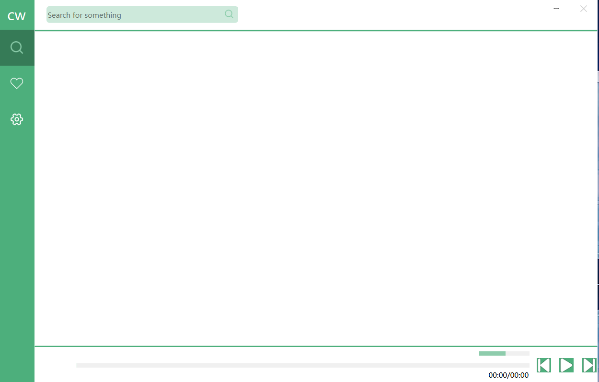
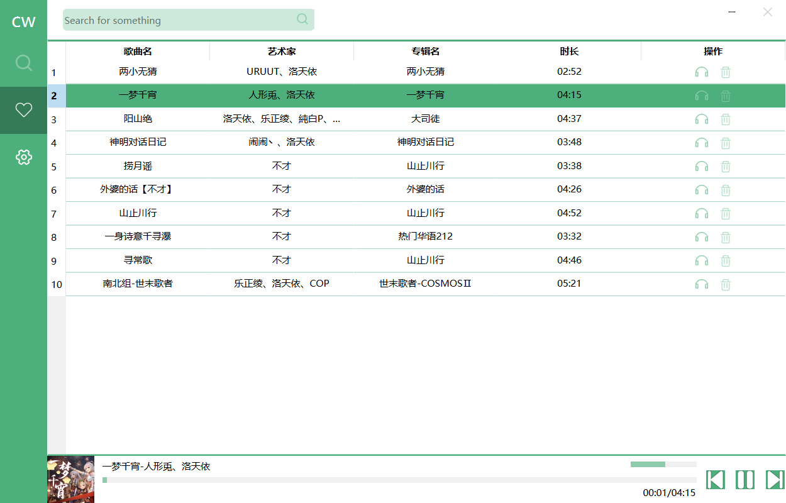

使用**PySide6**制作的一个在线音乐播放器

开发环境:Python(3.9.7)+Pyside6(6.2.3)+Pycharm

打包工具:pyinstaller

本软件仅供学习交流使用,代码已经开源:<a href="https://github.com/xianjuyao/PySide6_MusicPlayer">GitHub</a>

桌面版链接：<a href="https://pan.baidu.com/s/1mwYgTF0A6j1-mQUrI-1ljg">百度网盘</a> 提取码：8yby

界面UI部分参考:https://github.com/lyswhut/lx-music-desktop#readme

**声明:本软件接口均来自第三方,与本人无关。**

软件部分截图：

